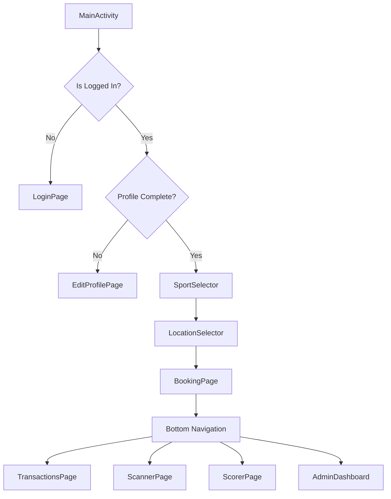

# 🏗️ Boxitt Android Architecture

## Overview
Boxitt is a native Android application built using Kotlin and Jetpack Compose. It follows **Clean Architecture** principles and the **MVVM (Model-View-ViewModel)** pattern to ensure scalability and maintainability.

---

## Directory Structure

```
app/src/main/java/com/boxitt/app/
├── components/                   # Reusable UI components
│   ├── DashboardNavbar.kt        # Top navigation bar
│   ├── QRCodeModal.kt            # QR display dialog
│   └── ...
├── pages/                        # Screen-level Composables
│   ├── LoginPage.kt              # Auth entry
│   ├── BookingPage.kt            # Slot booking flow
│   ├── ChallengesPage.kt         # Matchmaking UI
│   ├── AdminDashboard.kt         # Management portal
│   └── ...
├── navigation/                   # Navigation logic
│   ├── BoxittNavGraph.kt         # Compose Navigation graph
│   └── Screen.kt                 # Route definitions
├── services/                     # Business logic & API clients
│   ├── Supabase.kt               # Supabase SDK initialization
│   ├── SessionManager.kt         # Auth state & DataStore
│   ├── ChallengeService.kt       # Matchmaking logic
│   └── Storage.kt                # Local caching helper
├── model/                        # Kotlin Data Classes
├── di/                           # Hilt DI Modules
├── theme/                        # Design System (Colors, Typography)
├── App.kt                        # Main application UI wrapper
├── BoxApp.kt                     # Hilt Application class
└── MainActivity.kt               # Entry Activity
```

---

## Technology Stack

### Core
- **Kotlin** - Primary language
- **Jetpack Compose** - Declarative UI framework
- **Hilt** - Dependency Injection
- **Coroutines & Flow** - Asynchronous programming

### Backend Integration
- **Supabase Kotlin SDK** - Database, Auth, Realtime, and Storage
- **Ktor/OkHttp** - Underlying networking
- **Serialization** - Kotlinx Serialization

### Utilities
- **Coil** - Image loading
- **ML Kit** - Barcode/QR scanning
- **DataStore** - Reactive local preferences

---

## Data Model (Partial)

### User Profile
```kotlin
data class UserProfile(
    val id: String,
    val email: String,
    val displayName: String?,
    val role: String, // user, admin, superadmin
    val role_status: String // pending, approved
)
```

### Booking
```kotlin
data class Booking(
    val id: String,
    val date: String,
    val slotTime: String,
    val locationId: String,
    val status: String,
    val sport: String,
    val checkedIn: Boolean
)
```

---

## Navigation Flow

The app uses `androidx.navigation.compose` for routing:



---

## State Management

- **UI State**: Managed within ViewModels using `StateFlow` and collected in Composables as `collectAsStateWithLifecycle()`.
- **Global State**: `SessionManager` tracks authentication status and user preferences across the app.
- **Persistent State**: `DataStore` handles auth tokens and theme settings.

---

## Admin & Security

### Role-Based Access
- **User**: Can book slots and join challenges.
- **Admin**: Manages specific assigned locations.
- **SuperAdmin**: Full system access, including arena creation and user approval.

### Database Security
- **Row-Level Security (RLS)**: Enforced at the Supabase/PostgreSQL level to ensure users can only access their own data.

---

## Error Handling

A centralized `ErrorHandler` maps technical exceptions (e.g., Ktor timeouts, Supabase errors) to user-friendly messages displayed via a global alert system in `App.kt`.
